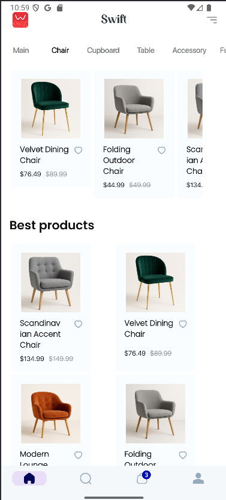
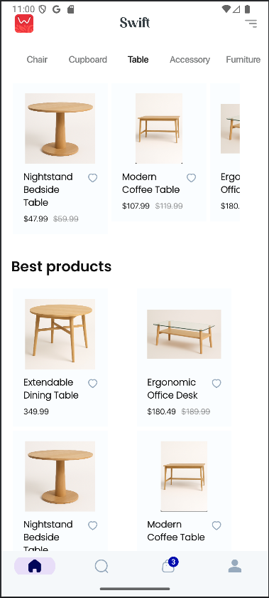

# SwiftCart

> **An Android e-commerce application** built with Kotlin, MVVM & Hilt, powered by Firebase Auth, Firestore & Storage.

SwiftCart is a feature-rich shopping app that lets users browse products, add to cart, place orders, and manage their profile and addresses. It uses modern Android architecture (MVVM), Hilt for dependency injection, and Firebase for all backend needs no custom server required.

---

## 📝 Table of Contents

1. [Features](#-features)  
2. [Tech Stack](#-tech-stack)  
3. [Architecture](#-architecture)  
4. [Getting Started](#-getting-started)  
5. [Project Structure](#-project-structure)  
6. [Screenshots](#-screenshots)  

---

## 🔑 Features

- **Authentication**  
  - Email/password sign-up, login & email verification  
- **Product Catalog**  
  - Browse by **Category**, **Best Deals** & **Special Products**  
- **Cart & Checkout**  
  - Real-time cart syncing, quantity updates, place order workflow  
- **Order Management**  
  - View order history, order status updates, admin “all orders” view  
- **Profile & Addresses**  
  - Add/edit/delete shipping addresses  
- **Admin Panel (in-app)**  
  - Create & update products (name, description, price, offer %, images, colors, sizes, special flag)  
- **Paging & Infinite Scroll**  
  - Load more items on demand for large collections  
- **Material UI**  
  - Material3 theming, Chip ​selectors, CardViews, BottomNavigation  

---

## 🛠️ Tech Stack

- **Language:** Kotlin  
- **Architecture:** MVVM (ViewModel + LiveData/StateFlow)  
- **DI:** Hilt  
- **UI Toolkit:** AndroidX, Jetpack Compose (where applicable), Material3 components  
- **Backend:**  
  - **Firebase Auth** (authentication)  
  - **Cloud Firestore** (NoSQL database)  
  - **Firebase Storage** (product images)  
- **Image Loading:** Glide  
- **Navigation:** Jetpack Navigation Component  
- **Persistence:** SharedPreferences (for simple flags)  
- **Coroutines:** Kotlin Coroutines & Flow  

---

## 🏛️ Architecture


1. **UI**  
   - Single-Activity (`ShoppingActivity` / `LoginRegisterActivity`)
   - Fragments per screen (Home, Category, Cart, Profile, Admin…)
2. **ViewModel**  
   - Exposes StateFlow / LiveData of UI state  
   - Coordinates data loading, paging, error/loading handling  
3. **Repository**  
   - Wraps `FirebaseAuth`, `FirebaseFirestore`, `FirebaseStorage`  
   - Performs queries, batch writes, transactions  
4. **DI**  
   - `@HiltAndroidApp` application  
   - Provides singletons for Firebase services  

---

## 🚀 Getting Started

### Prerequisites

- Android Studio Electric Eel (or later)  
- A Firebase project with Firestore & Auth enabled  
- Android device or emulator running API 24+  

### Setup

1. **Clone the repo**  
   ```bash
   git clone https://github.com/ahsanhabib98/swiftcart.git
   cd swiftcart/app

2. **Firebase Configuration** 
- In Android Studio project, go to `Tools` > `Firebase` > `Authentication` > `Authenticate using a custom authentication system`:
  - First, `Connect to Firebase`
  - After that, `Add the Firebase Authentication SDK to your app`

- Now open your project's [Firebase Console](https://console.firebase.google.com/) > `Authentication` > `Sign-in method`:
  - Enable `Email/Password`
  - Do not enable `Email link (passwordless sign-in)`

- Enable `Firestore Database`, open `Rules` tab and use this rule:

```
rules_version = '2';

service cloud.firestore {
  match /databases/{database}/documents {    
    // Everyone can read, but no one can write to admin collection
    match /admin/{adminId} {
      allow read: if request.auth != null;
			allow write: if false;
    }

    // Users can read user collection, and can edit their own collection
    match /user/{userId} {
      allow read: if request.auth != null;
      allow write: if request.auth != null && (request.auth.uid == userId || isUserAdmin());
      
      match /cart/{document=**} {
        allow read, write: if request.auth != null && (request.auth.uid == userId || isUserAdmin());
      }
      
      match /address/{document=**} {
        allow read, write: if request.auth != null && (request.auth.uid == userId || isUserAdmin());
      }
      
      match /order/{document=**} {
        allow read, write: if request.auth != null && (request.auth.uid == userId || isUserAdmin());
      }
    }
    
    // Allow read access to product for everyone, but write access only for admins
    match /product/{productId} {
      allow read: if request.auth != null;
      allow write: if request.auth != null && isUserAdmin();
    }
    
    // Allow users to read order list if the order contains their userId
    // Or, allow read and write access to list of order only for admins
    match /order/{orderId} {
    	allow read: if request.auth != null && (resource.data.userId == request.auth.uid || isUserAdmin());
      allow write: if request.auth != null && isUserAdmin();
    }

    // Function to check if the user is an admin
    function isUserAdmin() {
      return get(/databases/$(database)/documents/admin/$(request.auth.uid)).data != null;
    }
  }
}
```

- Enable `Firebase Storage`
- To add Query go to the Firestore console `Firebase Console` > `Firestore Database` > `Indexes` > `Add composite index`
  - Add Collection ID `product` with `category` and `price` fields as `Ascending` and `Descending`
  - Add Collection ID `product` with `category` and `offerPercentage` fields as `Ascending` and `Descending`
---

## 📂 Project Structure
    app/
    ├─ src/main/java/com/ecommerce/swift/
    │  ├─ data/             # Models & PagingInfo
    │  ├─ ui/
    │  │  ├─ fragments/     # Screens (Home, Cart, Billing…)
    │  │  ├─ adapters/      # RecyclerView Adapters
    │  │  ├─ viewmodels/    # ViewModel classes
    │  │  └─ dialogs/       # Common dialogs & utilities
    │  ├─ utils/            # Constants, extensions, decorators
    │  └─ Swift.kt          # @HiltAndroidApp Application class
    ├─ build.gradle.kts
    └─ AndroidManifest.xml

---

## 📸 Screenshots
<table>
  <tr>
    <td></td>
    <td></td>
    <td></td>
    <td></td>
    <td></td>
  </tr>
  <tr>
    <td></td>
    <td></td>
    <td></td>
    <td></td>
    <td></td>
  </tr>
</table>

---